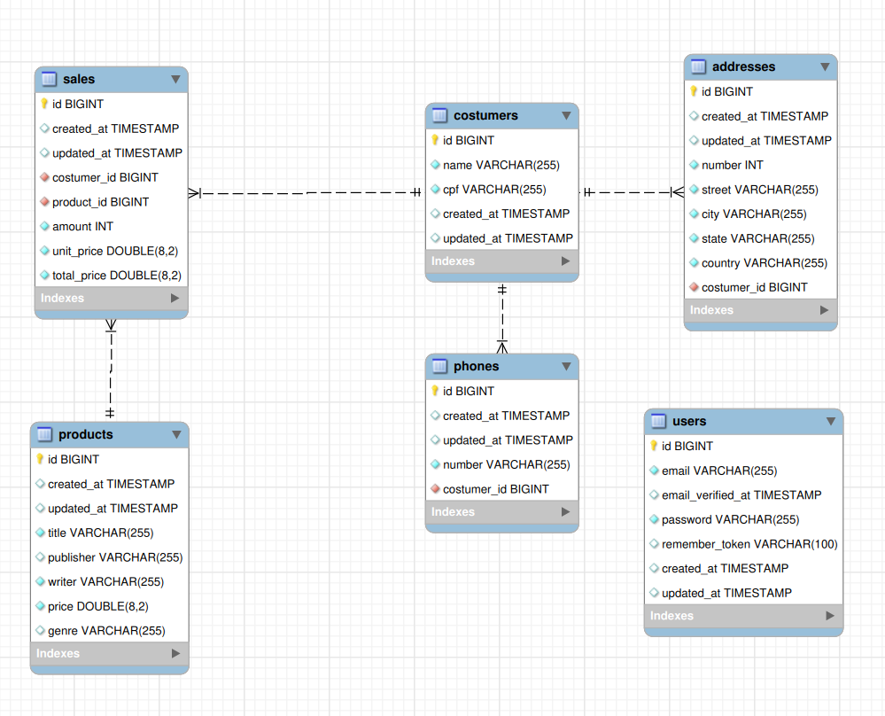

## Desafio Back-end 

### Requisitos

 - Laravel 9
 - PHP 8
 - MySQL

### Como executar

 - Após clonar o repositório, preencha os campos do arquivo de variáveis de ambiente (.env) com as informações corretas do seu ambiente.
 - Instale ou atualize as dependências do arquivo composer.json, se necessário.
 - Use o comando `php artisan migrate` para criar as tabelas do banco de dados. Se desejar, utilize `php artisan db:seed` para alimentar o banco de dados.
 - `php artisan serve` para iniciar o servidor e poder fazer as requisições.
 
**[Detalhes das rotas](https://documenter.getpostman.com/view/20220441/UyrGCa8q#a0009dd0-4950-4f68-885a-55032b424c39)**

### Modelo do banco de dados

